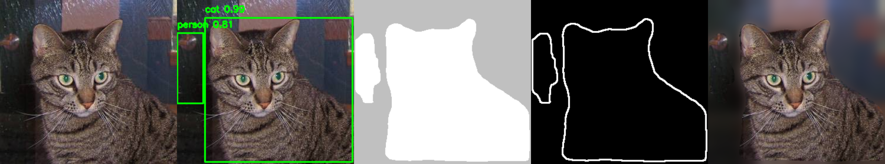

# Image Segmentation Project

Image segmentation and object detection with Mask R-CNN.

## Description

This project uses the **Mask R-CNN** model with a ResNet50-FPN backbone to perform instance segmentation on images. Mask R-CNN is a powerful deep learning architecture that extends Faster R-CNN by adding a branch for predicting segmentation masks on each Region of Interest (RoI). It can simultaneously detect objects, provide bounding boxes, and generate pixel-level segmentation masks for each detected instance.

The model is pre-trained on the COCO dataset and can detect 80 different object classes including persons, animals, vehicles, and everyday objects.

The project processes images from a `dataset` folder organized by categories and generates composite results in the `output` folder.

## Features

- **Object Detection**: Detects objects with bounding boxes and confidence scores
- **Instance Segmentation**: Generates precise pixel-level masks for each detected instance
- **White/Gray Mask**: Displays detected objects in white on a gray background
- **Contours**: Extracts and displays object contours
- **Blurred Background**: Creates a selective blur effect on the background
- **Composite Image**: Combines all 5 visualizations side by side (original, boxes, mask, contours, blur)

## Project Structure

```
.
├── test_model.py                   # Main script
├── dataset/                        # Input folder
│   ├── cats/
│   ├── dogs/
│   ├── flowers/
│   ├── horses/
│   └── human/
└── output/                         # Output folder (results)
    ├── cats/
    ├── dogs/
    ├── flowers/
    ├── horses/
    └── human/
```

## Installation

```bash
pip install torch torchvision opencv-python numpy
```

**Note**: For GPU support, install PyTorch with CUDA support following the instructions at [pytorch.org](https://pytorch.org/).

## Usage

```bash
python test_model.py
```

The script processes all images from the `dataset/` folder and saves composite results to `output/`.

## Parameters

Configurable in the code:

| Parameter | Value | Description |
|-----------|-------|-------------|
| `DESIRED_HEIGHT` | 480 | Target display height |
| `DESIRED_WIDTH` | 480 | Target display width |
| `SCORE_THRESHOLD` | 0.7 | Confidence threshold for object detection |
| `MASK_THRESHOLD` | 0.5 | Threshold for mask binarization |
| `BLUR_KERNEL` | (55, 55) | Gaussian kernel size |
| `BG_COLOR` | (192, 192, 192) | Background color for mask visualization |
| `MASK_COLOR` | (255, 255, 255) | Foreground color for mask visualization |

## Supported Formats

- JPG
- JPEG
- PNG

## Dataset

Source: [Images Dataset on Kaggle](https://www.kaggle.com/datasets/pavansanagapati/images-dataset)

**Note**: Only the first 9 images from each folder (cats, dogs, flowers, horses, human) were kept for this project.

## Detected Object Classes

The model is pre-trained on the COCO dataset and can detect 80 different object classes including:
- **Animals**: person, bird, cat, dog, horse, sheep, cow, elephant, bear, zebra, giraffe
- **Vehicles**: bicycle, car, motorcycle, airplane, bus, train, truck, boat
- **Indoor objects**: chair, couch, bed, dining table, toilet, tv, laptop, etc.
- **Food items**: banana, apple, sandwich, orange, pizza, etc.

For a complete list, see the `COCO_CLASSES` variable in [test_model.py](test_model.py).

## Output example

The output image will be a composite of 5 visualizations displayed side by side:
1. **Original image**: The unmodified input image
2. **Bounding boxes**: Detected objects with boxes and labels
3. **Mask**: Binary mask showing segmented objects in white on gray background
4. **Contours**: Object contours extracted from the mask
5. **Blurred background**: Original with background selectively blurred


